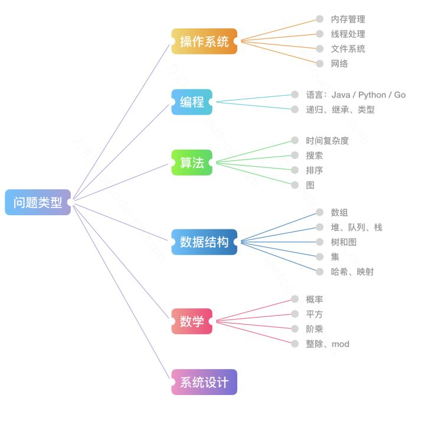

# LeetCode Solutions By Lucifer

简体中文 \| [English](readme.en.md)

这个是我写的[纪念项目 Star 突破 1W 的一个短文](thanksgiving.md)， 记录了项目的"兴起"之路, 大家有兴趣可以看一下， 如果对这个项目感兴趣，请**点击一下Star**， 项目会**持续更新**，感谢大家的支持

## 关于我

擅长前端工程化，前端性能优化，前端标准化等，做过.net， 搞过Java，现在是一名前端工程师，我的个人博客：[https://lucifer.ren/blog/](https://lucifer.ren/blog/)

我经常会在开源社区进行一些输出和分享，比较受欢迎的有[宇宙最强的前端面试指南](https://github.com/azl397985856/fe-interview) 和[我的第一本小书](https://github.com/azl397985856/automate-everything)。目前本人正在写一本关于《leetcode题解》的实体书，因此可能更新会比较慢，如果有人想要做些贡献或者合作的也可以直接用下面的邮箱联系我。

另外如果大家需要内推的可以找我，我这里有包括阿里，腾讯，头条，网易等很多公司的朋友。有需要可以直接群里联系我，或者发送到我的个人邮箱 \[azl397985856@gmail.com\]。

## 食用指南

* 这里有一份leetcode官方账号在知乎上给出的一个《互联网公司最常见的面试算法题有哪些？》的答案，我这里尽量去覆盖回答中的题目和知识点 原文地址： [https://www.zhihu.com/question/24964987/answer/586425979](https://www.zhihu.com/question/24964987/answer/586425979)
* 这里有一张互联网公司面试中经常考察的问题类型总结的思维导图，我们可以结合图片中的信息分析一下。

\(图片来自leetcode\)

其中算法，主要是以下几种：

* 基础技巧：分治、二分、贪心
* 排序算法：快速排序、归并排序、计数排序
* 搜索算法：回溯、递归、深度优先遍历，广度优先遍历，二叉搜索树等
* 图论：最短路径、最小生成树
* 动态规划：背包问题、最长子序列

数据结构，主要有如下几种：

* 数组与链表：单 / 双向链表
* 栈与队列
* 哈希表
* 堆：最大堆 ／ 最小堆
* 树与图：最近公共祖先、并查集
* 字符串：前缀树（字典树） ／ 后缀树

## 关注我

我重新整理了下自己的公众号，并且我还给它换了一个名字`脑洞前端`，它是一个帮助你打开大前端新世界大门的钥匙 🔑，在这里你可以听到新奇的观点，看到一些技术尝新，还会收到系统性总结和思考。

在这里我会尽量通过图的形式来阐述一些概念和逻辑，帮助大家快速理解，图解是我的目标。

之后我的文章会同步到微信公众号 `脑洞前端` ，你可以关注获取最新的文章，并和我进行交流。

另外你可以回复大前端进大前端微信交流群， 回复 leetcode 拉你进 leetcode 微信群，如果想加入 qq 群，请回复 qq。

## 捐赠

[点击查看完整的捐赠列表](donation.md)

### 微信

### 支付宝

## 贡献

* 如果有想法和创意，请提[issue](https://github.com/azl397985856/leetcode/issues)或者进群提
* 如果想贡献代码，请提[PR](https://github.com/azl397985856/leetcode/pulls)
* 如果需要修改项目中图片，[这里](https://github.com/daisyliu618/leetcode/tree/26ac1eff1c95729babf665545167d4b9b19d1df4/assets/drawio/README.md)存放了项目中绘制图的源代码， 大家可以用[draw.io](https://www.draw.io/)打开进行编辑。

## 鸣谢

感谢为这个项目作出贡献的所有[小伙伴](https://github.com/azl397985856/leetcode/graphs/contributors)

## License

[Apache-2.0](https://github.com/daisyliu618/leetcode/tree/26ac1eff1c95729babf665545167d4b9b19d1df4/LICENSE.txt)

