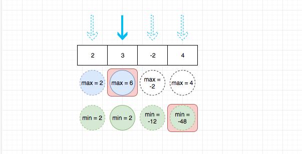

# 152.maximum-product-subarray

## 题目地址

[https://leetcode.com/problems/maximum-product-subarray/description/](https://leetcode.com/problems/maximum-product-subarray/description/)

## 题目描述

```text
Given an integer array nums, find the contiguous subarray within an array (containing at least one number) which has the largest product.

Example 1:

Input: [2,3,-2,4]
Output: 6
Explanation: [2,3] has the largest product 6.
Example 2:

Input: [-2,0,-1]
Output: 0
Explanation: The result cannot be 2, because [-2,-1] is not a subarray.
```

## 思路

> 这道题目的通过率非常低

这道题目要我们求解连续的 n 个数中乘积最大的积是多少。这里提到了连续，笔者首先 想到的就是滑动窗口，但是这里比较特殊，我们不能仅仅维护一个最大值，因此最小值（比如-20）乘以一个比较小的数（比如-10） 可能就会很大。 因此这种思路并不方便。

首先来暴力求解,我们使用两层循环来枚举所有可能项，这种解法的时间复杂度是O\(n^2\), 代码如下：

```javascript
var maxProduct = function(nums) {
  let max = nums[0];
  let temp = null;
  for (let i = 0; i < nums.length; i++) {
    temp = nums[i];
    max = Math.max(temp, max);
    for (let j = i + 1; j < nums.length; j++) {
      temp *= nums[j];
      max = Math.max(temp, max);
    }
  }

  return max;
};
```

因此我们需要同时记录乘积最大值和乘积最小值，然后比较元素和这两个的乘积，去不断更新最大值。



这种思路的解法由于只需要遍历一次，其时间复杂度是O\(n\)，代码见下方代码区。

## 关键点

* 同时记录乘积最大值和乘积最小值

## 代码

```javascript
/*
 * @lc app=leetcode id=152 lang=javascript
 *
 * [152] Maximum Product Subarray
 *
 * https://leetcode.com/problems/maximum-product-subarray/description/
 *
 * algorithms
 * Medium (28.61%)
 * Total Accepted:    202.8K
 * Total Submissions: 700K
 * Testcase Example:  '[2,3,-2,4]'
 *
 * Given an integer array nums, find the contiguous subarray within an array
 * (containing at least one number) which has the largest product.
 *
 * Example 1:
 *
 *
 * Input: [2,3,-2,4]
 * Output: 6
 * Explanation: [2,3] has the largest product 6.
 *
 *
 * Example 2:
 *
 *
 * Input: [-2,0,-1]
 * Output: 0
 * Explanation: The result cannot be 2, because [-2,-1] is not a subarray.
 *
 */
/**
 * @param {number[]} nums
 * @return {number}
 */
var maxProduct = function(nums) {
  let max = nums[0];
  let min = nums[0];
  let res = nums[0];

  for (let i = 1; i < nums.length; i++) {
    let tmp = min;
    min = Math.min(nums[i], Math.min(max * nums[i], min * nums[i])); // 取最小
    max = Math.max(nums[i], Math.max(max * nums[i], tmp * nums[i])); /// 取最大
    res = Math.max(res, max);
  }
  return res;
};
```

