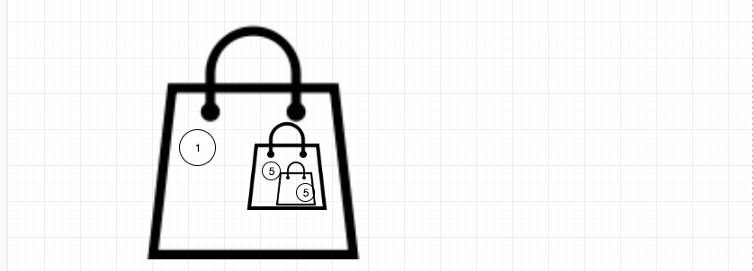
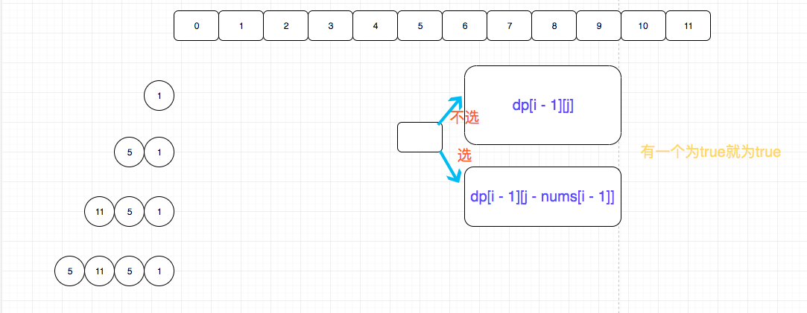

# 416.partition-equal-subset-sum

## 题目地址

[https://leetcode.com/problems/partition-equal-subset-sum/description/](https://leetcode.com/problems/partition-equal-subset-sum/description/)

## 题目描述

```text
Given a non-empty array containing only positive integers, find if the array can be partitioned into two subsets such that the sum of elements in both subsets is equal.

Note:

Each of the array element will not exceed 100.
The array size will not exceed 200.


Example 1:

Input: [1, 5, 11, 5]

Output: true

Explanation: The array can be partitioned as [1, 5, 5] and [11].


Example 2:

Input: [1, 2, 3, 5]

Output: false

Explanation: The array cannot be partitioned into equal sum subsets.
```

## 思路

题目要求给定一个数组， 问是否能划分为和相等的两个数组。

这是一个典型的背包问题，我们可以遍历数组，对于每一个，我们都分两种情况考虑，拿或者不拿。

背包问题处理这种离散的可以划分子问题解决的问题很有用。



如果能够识别出这是一道背包问题，那么就相对容易了。



## 关键点解析

* 背包问题

## 代码

```javascript
/*
 * @lc app=leetcode id=416 lang=javascript
 *
 * [416] Partition Equal Subset Sum
 *
 * https://leetcode.com/problems/partition-equal-subset-sum/description/
 *
 * algorithms
 * Medium (39.97%)
 * Total Accepted:    79.7K
 * Total Submissions: 198.5K
 * Testcase Example:  '[1,5,11,5]'
 *
 * Given a non-empty array containing only positive integers, find if the array
 * can be partitioned into two subsets such that the sum of elements in both
 * subsets is equal.
 * 
 * Note:
 * 
 * 
 * Each of the array element will not exceed 100.
 * The array size will not exceed 200.
 * 
 * 
 * 
 * 
 * Example 1:
 * 
 * 
 * Input: [1, 5, 11, 5]
 * 
 * Output: true
 * 
 * Explanation: The array can be partitioned as [1, 5, 5] and [11].
 * 
 * 
 * 
 * 
 * Example 2:
 * 
 * 
 * Input: [1, 2, 3, 5]
 * 
 * Output: false
 * 
 * Explanation: The array cannot be partitioned into equal sum subsets.
 * 
 * 
 * 
 * 
 */
/**
 * @param {number[]} nums
 * @return {boolean}
 */
var canPartition = function(nums) {
    let sum = 0;
    for(let num of nums) {
        sum += num;
    }

    if (sum & 1 === 1) return false;

    const half = sum >> 1;

    let dp = Array(half); 
    dp[0] = [true, ...Array(nums.length).fill(false)];

    for(let i = 1; i < nums.length + 1; i++) {
        dp[i] = [true, ...Array(half).fill(false)];
        for(let j = 1; j < half + 1; j++) {
            if (j >= nums[i - 1]) {
                dp[i][j] = dp[i - 1][j] || dp[i - 1][j - nums[i - 1]];
            }
        }
    }

    return dp[nums.length][half]
};
```

