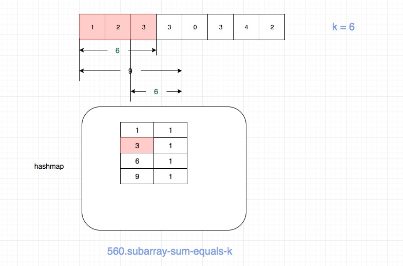

# 560.subarray-sum-equals-k

## 题目地址

[https://leetcode.com/problems/subarray-sum-equals-k/description/](https://leetcode.com/problems/subarray-sum-equals-k/description/)

## 题目描述

```text
Given an array of integers and an integer k, you need to find the total number of continuous subarrays whose sum equals to k.

Example 1:
Input:nums = [1,1,1], k = 2
Output: 2
Note:
The length of the array is in range [1, 20,000].
The range of numbers in the array is [-1000, 1000] and the range of the integer k is [-1e7, 1e7].
```

## 思路

符合直觉的做法是暴力求解所有的子数组，然后分别计算和，如果等于k,count就+1.这种做法的时间复杂度为O\(n^2\).

这里有一种更加巧妙的方法，我们可以借助额外的空间，使用hashmap来简化时间复杂度，这种算法的时间复杂度可以达到O\(n\).

我们维护一个hashmap，hashmap的key为累加值acc，value为累加值acc出现的次数。 我们迭代数组，然后不断更新acc和hashmap，如果acc 等于k，那么很明显应该+1. 如果hashmap\[acc - k\] 存在， 我们就把它加到结果中去即可。

语言比较难以解释，我画了一个图来演示nums = \[1,2,3,3,0,3,4,2\], k = 6的情况。



如图，当访问到nums\[3\]的时候，hashmap如图所示，这个时候count为2. 其中之一是\[1,2,3\],这个好理解。还有一个是\[3,3\].

这个\[3,3\]正是我们通过hashmap\[acc - k\]即hashmap\[9 - 6\]得到的。

## 关键点解析

* 可以利用hashmap记录和的累加值来避免重复计算

## 代码

* 语言支持：JS, Python

Javascript Code:

```javascript
/*
 * @lc app=leetcode id=560 lang=javascript
 *
 * [560] Subarray Sum Equals K
 */
/**
 * @param {number[]} nums
 * @param {number} k
 * @return {number}
 */
var subarraySum = function(nums, k) {
  const hashmap = {};
  let acc = 0;
  let count = 0;

  for (let i = 0; i < nums.length; i++) {
    acc += nums[i];

    if (acc === k) count++;

    if (hashmap[acc - k] !== void 0) {
      count += hashmap[acc - k];
    }

    if (hashmap[acc] === void 0) {
      hashmap[acc] = 1;
    } else {
      hashmap[acc] += 1;
    }
  }

  return count;
};
```

Python Code:

```python
class Solution:
    def subarraySum(self, nums: List[int], k: int) -> int:
        d = {}
        acc = count = 0
        for num in nums:
            acc += num
            if acc == k:
                count += 1
            if acc - k in d:
                count += d[acc-k]
            if acc in d:
                d[acc] += 1
            else:
                d[acc] = 1
        return count
```

## 扩展

这是一道类似的题目，但是会稍微复杂一点, 题目地址: [437.path-sum-iii](437.path-sum-iii.md)

