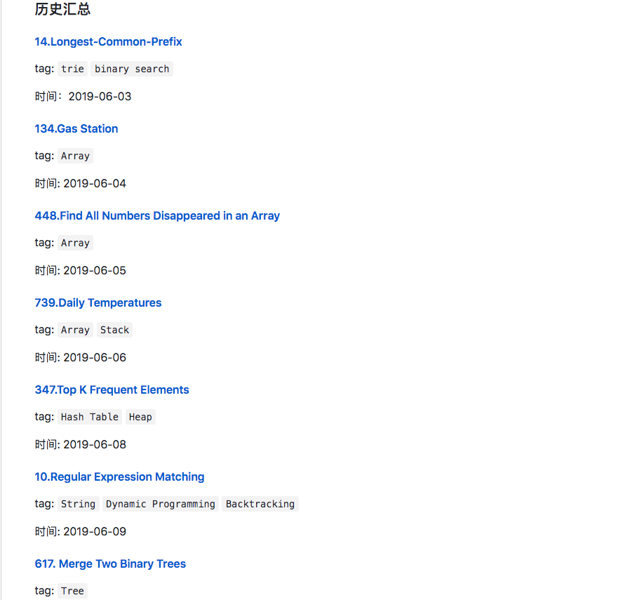
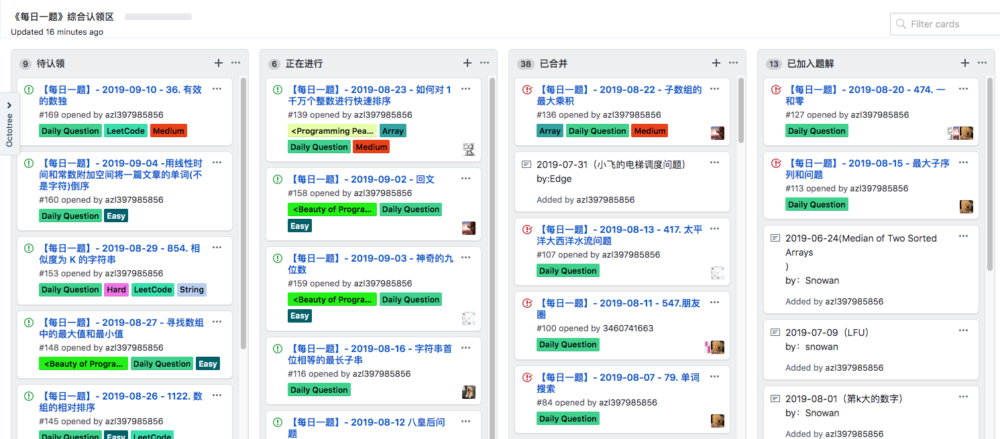

# 每日一题

每日一题是在交流群（包括微信和 qq）里通过issues来进行的一种活动，大家一起 解一道题，这样讨论问题更加集中，会得到更多的反馈。而且 这些题目可以被记录下来，日后会进行筛选添加到仓库的题解模块。

* [每日一题汇总](../../daily/)

* [每日一题认领区](https://github.com/azl397985856/leetcode/projects/1)

### 

