# ThanksGaving

就在今天，我的《leetcode题解》项目首次突破1wstar， 在这里我特地写下这篇文章来记录这个时刻，同时非常感谢大家的支持和陪伴。

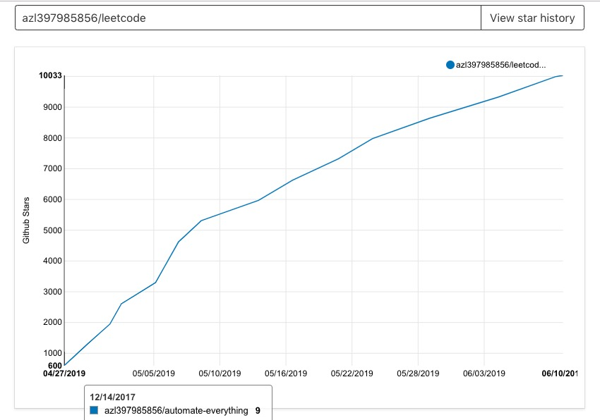

\(star增长曲线图\)

前几天，去了一趟山城重庆，在那里遇到了最美的人和最漂亮的风景。

我是一个念旧的人，现在是节后的第一天，让我开启回忆模式：

* 2017-05-30 项目成立，那是的它只是用来占位而已，目的就是让自己知道之后要做这件事。

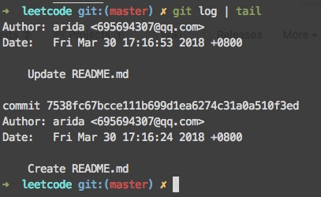

\(第一次提交\)

* 2017-12-14 项目也只有10个star，那是的项目其实就是几个孤零零的题目，事实上我也没有花精力去做。
* 2019-04 开始了井喷式的增长，我开始花时间去完成它，推广它

在朋友圈推广：

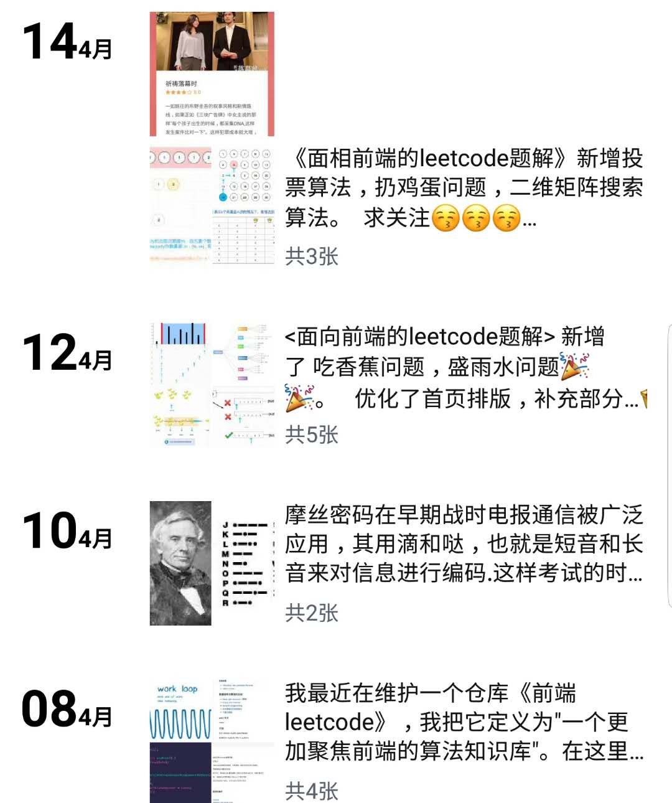

\(在朋友圈宣传\)

同时在掘金,sf以及知乎推广，但是收效不是很明显，那时候项目首次破百，这也是我第一个破百的项目。

* 之后我组建了微信和qq群，来让大家活跃起来，促进交流，戒指目前\(2019-06-10\)微信群总人数已经超过700，

  里面有非常多的学生，留学生以及全球各地各大公司的员工。

\(qq群\)

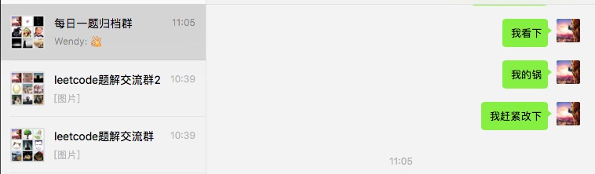

\(微信群\)

之后先后通过@每日时报, @阮一峰，@d2,@hello-github等的宣传，又迎来的一次高峰， 在那一段时间大概突破了1k。

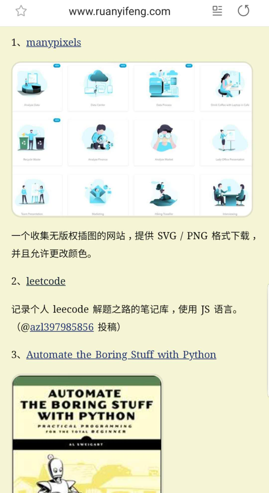

\(阮一峰的周报\)

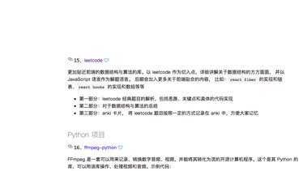

\(hello-github也收录了我和我的仓库\)

二次元的司徒正美老师虽然没有帮忙宣传，但是它的star也在某种程度上起到了宣传作用。

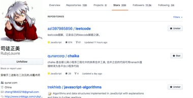

\(司徒正美\)

并且之后这个项目在github trending活跃了一个月左右，甚至有一次冲上了日榜的总榜第一，并被“开发者头条”收入《GitHub Trending - All - Daily》。

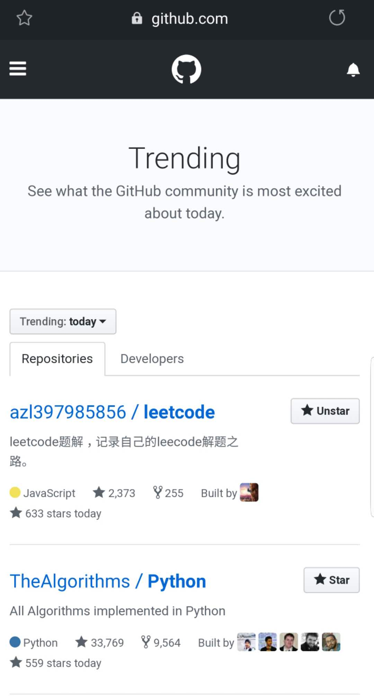

\(日榜第一\)

\(开发者头条的微博号\)

截止到2019-06-10，项目star首次破万，幸运的是我刚好捕捉到了第9999个小可爱.

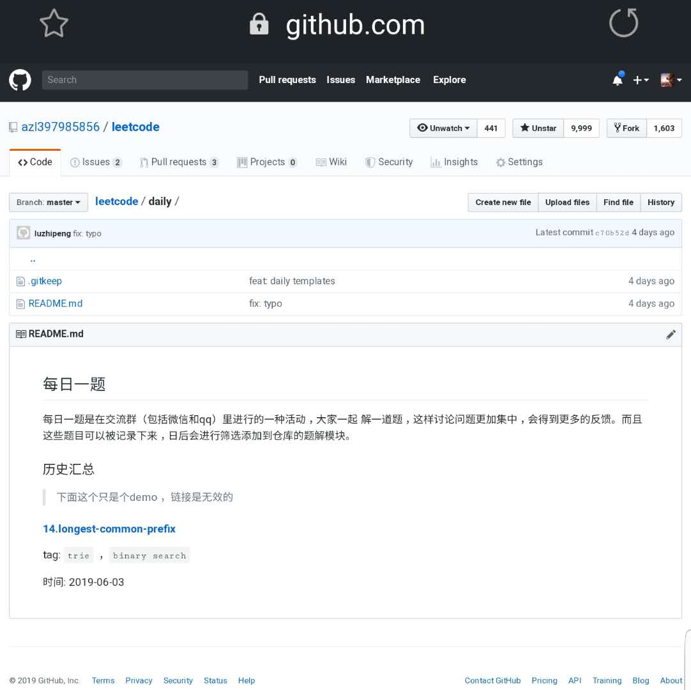

\(9999，一个很有意思的数字\)

* 现在这个项目不仅仅是自己做题，更多的是大家一起交流和成长。 

现在，项目除了JS，也在逐步加入C++，python，多编程语言正在筹备中。

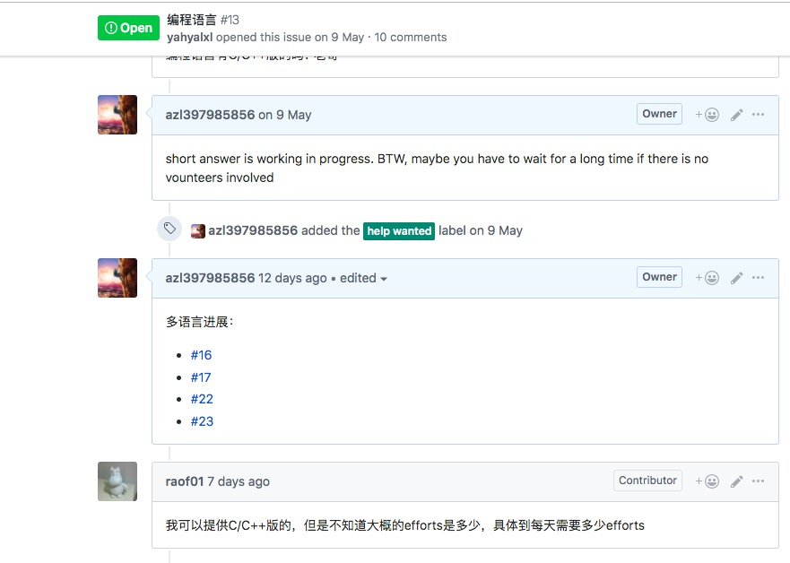

\(我们正在努力加入更多编程语言\)

另外，在大家的帮助下，我们也逐步走上了国际化，不仅仅有人来主动做翻译，还组建了电报群。

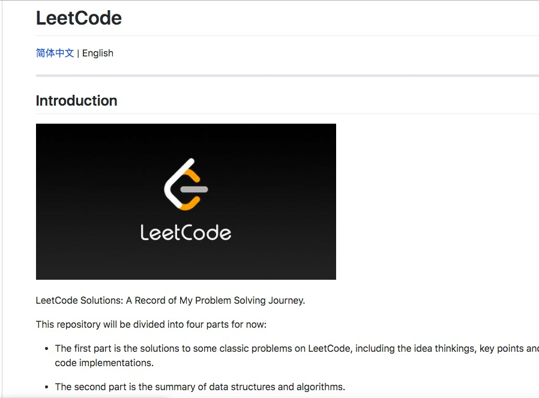

\(英文主页\)

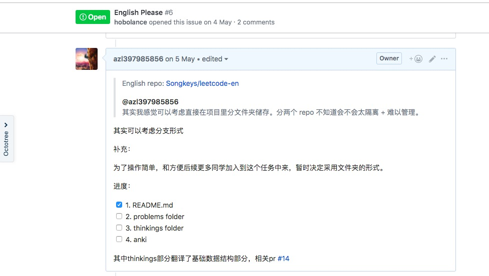

\(英文翻译进展\)

也不知道什么时候，《量子论》竟然悄悄地在知乎帮我宣传。

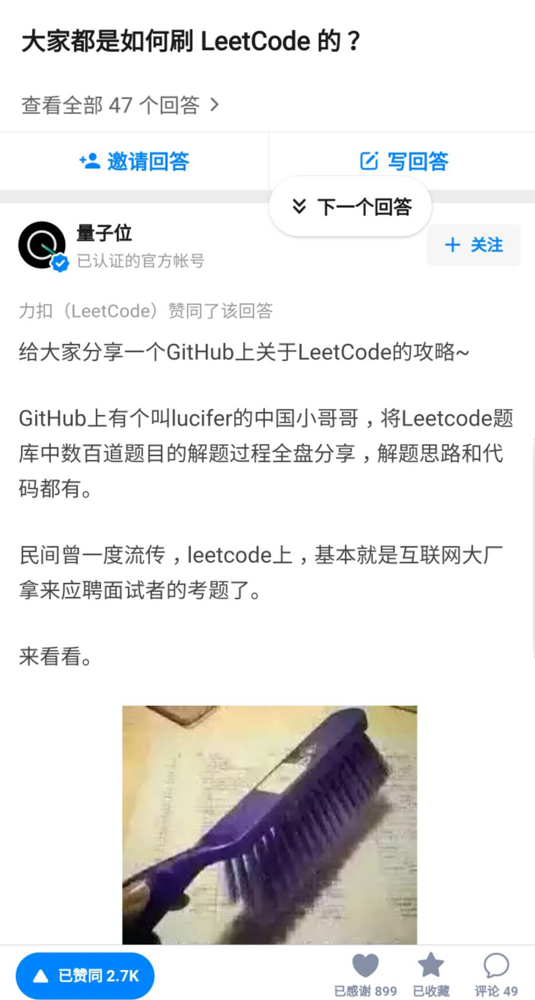

\(知乎 - 量子论\)

与此同时，我在知乎的最高赞竟然给了这条评论。

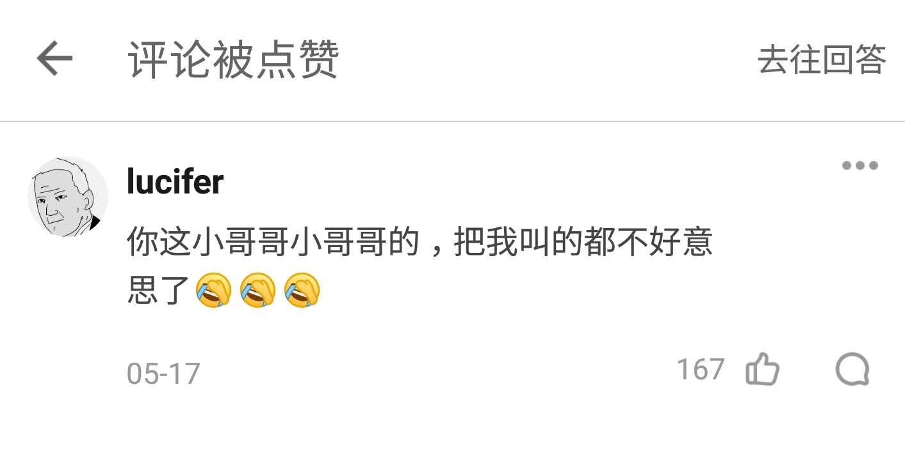

* 2019-06-04 首次在三个群里同步开通《每日一题》，大家也非常踊跃地帮忙整理题目，甚至出题给思路，非常感谢大家。

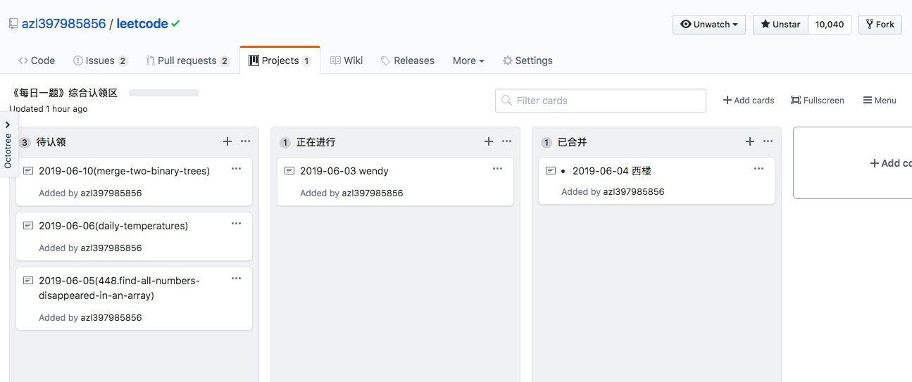

非常感谢大家一直以来的陪伴和支持，我们一起努力，加油💪。

如果你还没有加入我们，看了这篇文章想加入，那么可以访问我的项目主页 [leetcode题解](https://github.com/azl397985856/leetcode) 我在这里等着你。

PS: 有没有熟悉重庆的小伙伴，想请教一点事情，愿意的话加我私聊吧，先谢谢啦！

