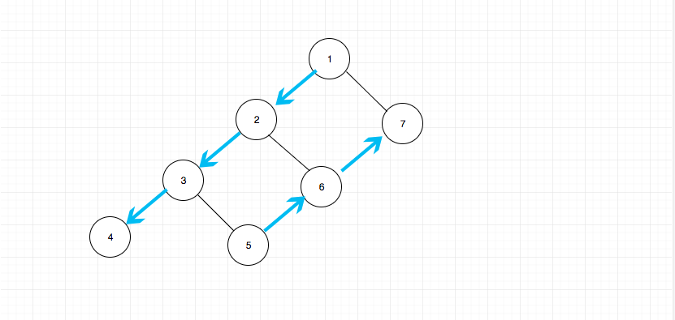

# Binary Tree Traversal

## Overview

Binary tree is a fundamental data structure. Traversal is a fundamental algorithm. Implementing traversal on binary tree makes a classical solution to problems. Many problems can be solved by trversaling binary tree, directly or indirectly.

> If you have a good understanding of binary tree, it is not hard for you to understand other trees more complicated.

The traversal of binary tree is basically comprised of in-order, pre-order, post-order and level-order traversals.

A tree is typically traversed in two ways:

* BFS \(Breadth First Search, or Level Order Search\)
* DFS \(Depth First Search\)
  * In-order \(Left-Root-Right\)
  * Pre-order \(Root-Left-Right\)
  * Post-order \(Left-Right-Root\)

Some problems can be solved with BFS and DFS, such as [301](../problems/301.remove-invalid-parentheses.md) and [609](../problems/609.find-duplicate-file-in-system.md)

DFS simplifies operations with stack. Meanwhile, a tree is a recursive data structure. It is important to grasp recursion and stack for understanding DFS.

Diagrammatic graph of DFS：

\(source: [https://github.com/trekhleb/javascript-algorithms/tree/master/src/algorithms/tree/depth-first-search](https://github.com/trekhleb/javascript-algorithms/tree/master/src/algorithms/tree/depth-first-search)\)

The key point of BFS is whether the travesals of each level are completed or not. An identifier bit can be used to represent that.

Then, let's talk about the in-order, pre-oder and post-order traversals.

## Pre-order

example: [144.binary-tree-preorder-traversal](../problems/144.binary-tree-preorder-traversal.md)

order of traversal: `root-left-right`

Algorithm Preorder\(tree\):

1. visit the root.
2. traverse the left subtree, i.e., call Preorder\(left-subtree\)
3. traverse the right subtree, i.e., call Preorder\(right-subtree\)

Summary:

* typically recursive data structure.
* typycally algorithm which simplifies operations by stack.

Actually, at the macro level, it can be described as `visit all left-side chain in sequence from top to bottom, and then, visit all right-side chain from bottom to top`

If we think from this point of view, the algorithm can be different. All nodes in the left-side chain can be visited recursively from top to bottom directly. And all nodes in the right-side chain can be visited with the help of stack.

The whole process is like this:

This idea is something like the `backtrack`. It is important, because this idea can help us to `unify the understanding of three traversal methods`.

## In-order

example: [94.binary-tree-inorder-traversal](../problems/94.binary-tree-inorder-traversal.md)

Order of In-order traversal: `Left-Root-Right`

Algorithm Inorder\(tree\):

1. Traverse the left subtree, i.e., call Inorder\(left-subtree\)
2. Visit the root
3. Traverse the right subtree, i.e., call Inorder\(right-subtree\)

It is worth noting that, the result of traversing a BST \(Binary Search Tree\) is an ordered array. With this property, some problems can be simplified, such as: [230.kth-smallest-element-in-a-bst](../problems/230.kth-smallest-element-in-a-bst.md) and [98.validate-binary-search-tree](../problems/98.validate-binary-search-tree.md)

## Post-order

example: [145.binary-tree-postorder-traversal](../problems/145.binary-tree-postorder-traversal.md)

Order of Post-order: `Left-Right-Root`

This one is a liitle difficult to understand.

But there is a clever trick to post-order traversal which is recording the trversal status of current node. If

1. current node is leaf node or
2. both left and right subtrees have been traversed

the node can be popped out the stack.

For condition 1, a leaf node is the node with no children \(both left and right children are null\); For condition 2, variables are required for recording the traversal status for each node. Due to the stack, only one variable is indispensable bacause this variable can be used.

## Level-order

The key point of level-order is recording the traversal status of each level. An identifier bit can be used to represent the status of current level.

\(source: [https://github.com/trekhleb/javascript-algorithms/tree/master/src/algorithms/tree/breadth-first-search](https://github.com/trekhleb/javascript-algorithms/tree/master/src/algorithms/tree/breadth-first-search)\)

Algorithm Level-order\(tree\):

1. push root into a queue. And put an identifier node into the queue which is null here.
2. pop out one node from the queue.
3. If the popped out node is not null, which means the traversal of current level is not finished, push the left and right node into the queue orderly.
4. If the popped out node is null, which means the traversal of current level is finished. Now if the queue is null, the traversal is done. If the queue is not null, push a null node into the queue.

example: [102.binary-tree-level-order-traversal](../problems/102.binary-tree-level-order-traversal.md)

