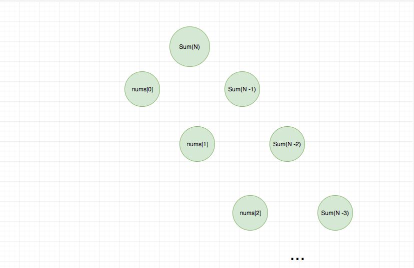
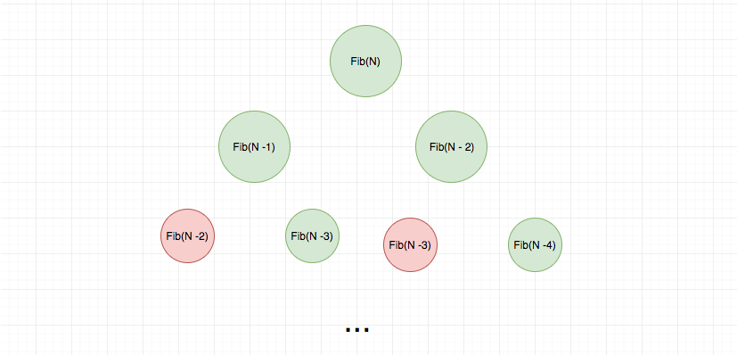

# 递归和动态规划

动态规划可以理解为是查表的递归。那么什么是递归？

## 递归

定义： 递归算法是一种直接或者间接调用自身函数或者方法的算法。

算法中使用递归可以很简单地完成一些用循环实现的功能，比如二叉树的左中右序遍历。递归在算法中有非常广泛的使用， 包括现在日趋流行的函数式编程。

> 纯粹的函数式编程中没有循环，只有递归。

接下来我们来讲解以下递归。通俗来说，递归算法的实质是把问题分解成规模缩小的同类问题的子问题，然后递归调用方法来表示问题的解

### 递归的三个要素

1. 一个问题的解可以分解为几个子问题的解
2. 子问题的求解思路除了规模之外，没有任何区别
3. 有递归终止条件

我这里列举了几道算法题目，这几道算法题目都可以用递归轻松写出来：

* 递归实现 sum
* 二叉树的遍历
* 走楼梯问题
* 汉诺塔问题

## 动态规划

`如果说递归是从问题的结果倒推，直到问题的规模缩小到寻常。 那么动态规划就是从寻常入手， 逐步扩大规模到最优子结构。` 这句话需要一定的时间来消化, 如果不理解，可以过一段时间再来看。

递归的解决问题非常符合人的直觉，代码写起来比较简单。但是我们通过分析（可以尝试画一个递归树），可以看出递归在缩小问题规模的同时可能会 重复计算。 [279.perfect-squares](../problems/279.perfect-squares.md) 中 我通过递归的方式来解决这个问题，同时内部维护了一个缓存 来存储计算过的运算，那么我们可以减少很多运算。 这其实和动态规划有着异曲同工的地方。

我们结合求和问题来讲解一下, 题目是给定一个数组，求出数组中所有项的和，要求使用递归实现。

代码：

```javascript
function sum(nums) {
  if (nums.length === 0) return 0;
  if (nums.length === 1) return nums[0];

  return nums[0] + sum(nums.slice(1));
}
```

我们用递归树来直观地看一下。



这种做法本身没有问题，但是每次执行一个函数都有一定的开销，拿 JS 引擎执行 JS 来说， 每次函数执行都会进行入栈操作，并进行预处理和执行过程，所以对于内存来说是一个挑战。 很容易造成爆栈。

> 浏览器中的 JS 引擎对于代码执行栈的长度是有限制的，超过会爆栈，抛出异常。

我们再举一个更加明显的例子，问题描述：

一个人爬楼梯，每次只能爬 1 个或 2 个台阶，假设有 n 个台阶，那么这个人有多少种不同的爬楼梯方法？

代码：

```javascript
function climbStairs(n) {
  if (n === 1) return 1;
  if (n === 2) return 2;
  return climbStairs(n - 1) + climbStairs(n - 2);
}
```

这道题和 fibnacci 数列一摸一样，我们继续用一个递归树来直观感受以下：



可以看出这里面有很多重复计算，我们可以使用一个 hashtable 去缓存中间计算结果，从而省去不必要的计算。 那么动态规划是怎么解决这个问题呢？ 答案就是“查表”。

刚才我们说了`递归是从问题的结果倒推，直到问题的规模缩小到寻常。 动态规划是从寻常入手， 逐步扩大规模到最优子结构。`

从刚才的两个例子，我想大家可能对前半句话有了一定的理解，我们接下来讲解下后半句。

如果爬楼梯的问题，使用动态规划，代码是这样的：

```javascript
function climbStairs(n) {
  if (n === 1) return 1;
  if (n === 2) return 2;

  let a = 1;
  let b = 2;
  let temp;

  for (let i = 3; i <= n; i++) {
    temp = a + b;
    a = b;
    b = temp;
  }

  return temp;
}
```

动态规划的查表过程如果画成图，就是这样的：


> 虚线代表的是查表过程

这道题目是动态规划中最简单的问题了，因为设计到单个因素的变化，如果涉及到多个因素，就比较复杂了，比如著名的背包问题，挖金矿问题等。

对于单个因素的，我们最多只需要一个一维数组即可，对于如背包问题我们需要二维数组等更高纬度。

> 爬楼梯我们并没有使用一维数组，而是借助两个变量来实现的，空间复杂度是 O\(1\). 之所以能这么做，是因为爬楼梯问题的状态转移方程只和前两个有关，因此只需要存储这两个即可。 动态规划问题有时候有很多这种讨巧的方式，但并不是所有的

### 动态规划的两个要素

1. 状态转移方程
2. 临界条件

在上面讲解的爬楼梯问题中

```text
f(1) 与 f(2) 就是【边界】
f(n) = f(n-1) + f(n-2) 就是【状态转移公式】
```

### 动态规划为什么要画表格

动态规划问题要画表格，但是有的人不知道为什么要画，就觉得这个是必然的，必要要画表格才是动态规划。

其实动态规划本质上是将大问题转化为小问题，然后大问题的解是和小问题有关联的，换句话说大问题可以由小问题进行计算得到。

这一点是和递归一样的， 但是动态规划是一种类似查表的方法来缩短时间复杂度和空间复杂度。

画表格的目的就是去不断推导，完成状态转移， 表格中的每一个cell都是一个`小问题`， 我们填表的过程其实就是在解决问题的过程， 我们先解决规模为寻常的情况，然后根据这个结果逐步推导，通常情况下，表格的右下角是问题的最大的规模，也就是我们想要求解的规模。

比如我们用动态规划解决背包问题， 其实就是在不断根据之前的小问题`A[i - 1][j] A[i -1][w - wj]`来询问：

1. 我是应该选择它
2. 还是不选择它

至于判断的标准很简单，就是价值最大，因此我们要做的就是对于选择和不选择两种情况分别求价值，然后取最大，最后更新cell即可。

### 相关问题

* [0091.decode-ways](../problems/91.decode-ways.md)
* [0139.word-break](../problems/139.word-break.md)
* [0198.house-robber](https://github.com/daisyliu618/leetcode/tree/26ac1eff1c95729babf665545167d4b9b19d1df4/problems/0198.house-robber.md)
* [0309.best-time-to-buy-and-sell-stock-with-cooldown](../problems/309.best-time-to-buy-and-sell-stock-with-cooldown.md)
* [0322.coin-change](../problems/322.coin-change.md)
* [0416.partition-equal-subset-sum](../problems/416.partition-equal-subset-sum.md)
* [0518.coin-change-2](../problems/518.coin-change-2.md)

> 太多了，没有逐一列举

## 总结

本篇文章总结了算法中比较常用的两个方法 - 递归和动态规划。

如果你只能借助一句话，那么请记住：`递归是从问题的结果倒推，直到问题的规模缩小到寻常。 动态规划是从寻常入手， 逐步扩大规模到最优子结构。`

